# WEFT — a compiler for woven single-thread walls, with a Gate that refuses

<p align="center">
  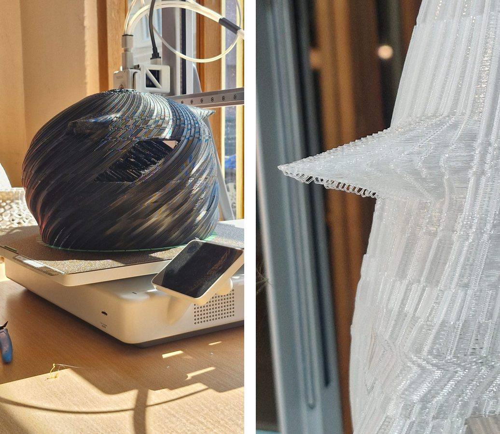
  <br><sub>OBLAK on the Bambu Lab A2L (left) and a horn of GORA, printed on a Creality Ender-3 V4 (right). Both were gated at a declared 60 mm experimental bridge ceiling and printed to full height.</sub>
</p>

WEFT prints walls as **woven lattices**: one continuous thread per body and layer, with structure coming from
discrete **weld nodes** where each layer's thread crosses the one below, rather than from bulk material contact.
The compiler lowers an architectural form through three levels — global topology, meso lattice, micro thread — and
emits machine code directly. Before anything reaches a printer, a **Refusing Gate** parses the final G-code,
rasterises the layer below, takes a Euclidean distance transform and refuses every extruding point that has nothing
under it. Polymer on desktop printers is the research vehicle; continuous-toolpath concrete and clay printing is
the target.

**Research software of the Printable Intelligence project**
Faculty of Construction Management, University "Union – Nikola Tesla", Belgrade, Serbia.

**Authors:** Semir Poturak · Jelena Mitrović · Bojan Končarević · Matija Vračarić · Tara Stojiljković
(see [`AUTHORS.md`](AUTHORS.md) and [`CITATION.cff`](CITATION.cff)). Contact: poturaksemir@gmail.com. Licence: MIT.

**Paper:** *Printable Intelligence: The Leap into Micro-Structures and Tracing Human-AI Fabrication* — submitted
to STRAND / ON ARCHITECTURE 2026 (Belgrade). Everything the paper counts is recomputable from this repository
(see [Reproducing the paper](#reproducing-the-paper)).

---

## What is in the pictures

Thirteen physical objects were printed between 13 August and 6 September 2026 — eleven on a Bambu Lab A2L or a
Creality Ender-3 V4, two early ones on a machine the record does not name. The record of each one — geometry, Gate verdict, build report, manifest, outcome, photograph manifest —
is in [`specimens/`](specimens/). A selection, with the captions the paper uses:

<table>
<tr>
<td width="33%">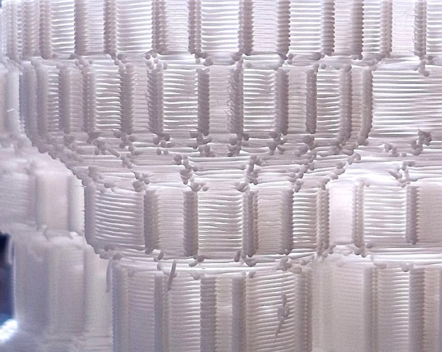<br><sub><b>The weave.</b> Wall of P0 Šuma 2x2: horizontal chord rails, web rungs crossing between them, and weld beads at the inter-layer crossings. WEFT geometry sliced in Bambu Studio and printed on the A2L (Route A).</sub></td>
<td width="33%">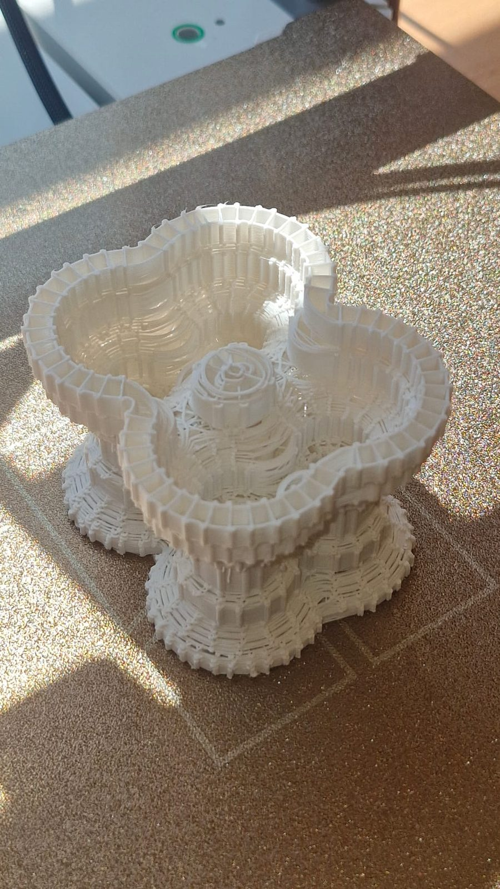<br><sub><b>P0 Šuma 2x2</b> (73 x 87 x 60 mm): a slab that splits into four columns, which merge to two and to one — the first object in which the compiler planned splits and merges itself, printed correctly first try.</sub></td>
<td width="33%">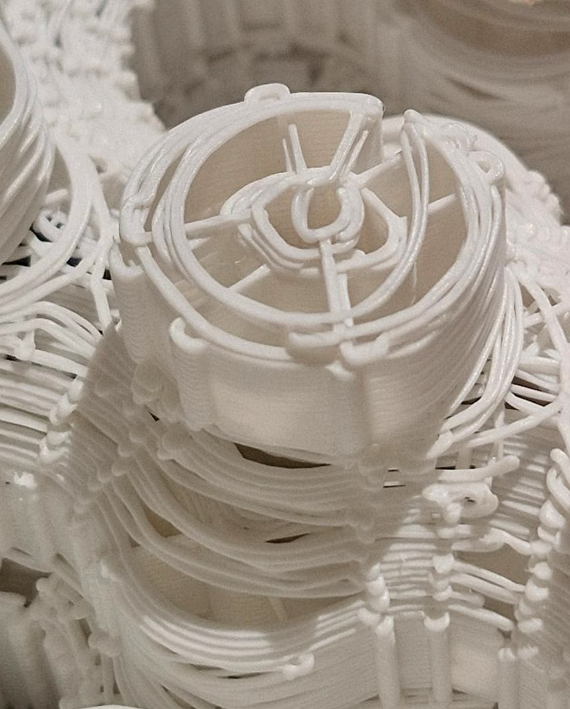<br><sub><b>A hole allowed to die.</b> The interior courtyard of Šuma 2x2 shrank ring by ring (r 7.9 → 6.3 → 5.1 mm) and ended in loose loops and a knot — the defect the topological level of the compiler must forbid.</sub></td>
</tr>
<tr>
<td>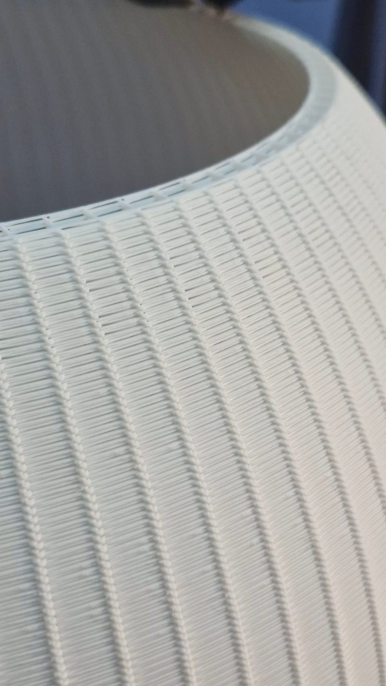<br><sub><b>D5 R140 dome</b> (300.8 x 300.6 x 139.9 mm, 584 layers). Printed to full height on the A2L; the body weave is clean over 360 degrees.</sub></td>
<td>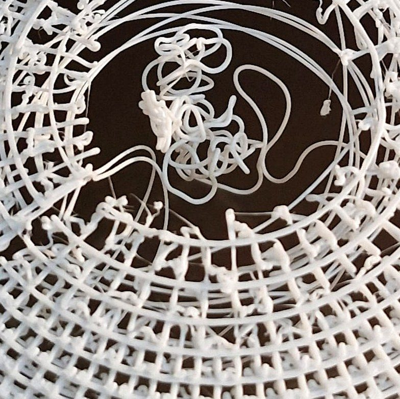<br><sub><b>The crown that did not close.</b> Beyond the last complete ring the thread no longer meets the footprint of the layer below and falls as free loops across an open hole of about 25–35 mm. The Printable Footprint Rule was written in answer to this failure.</sub></td>
<td>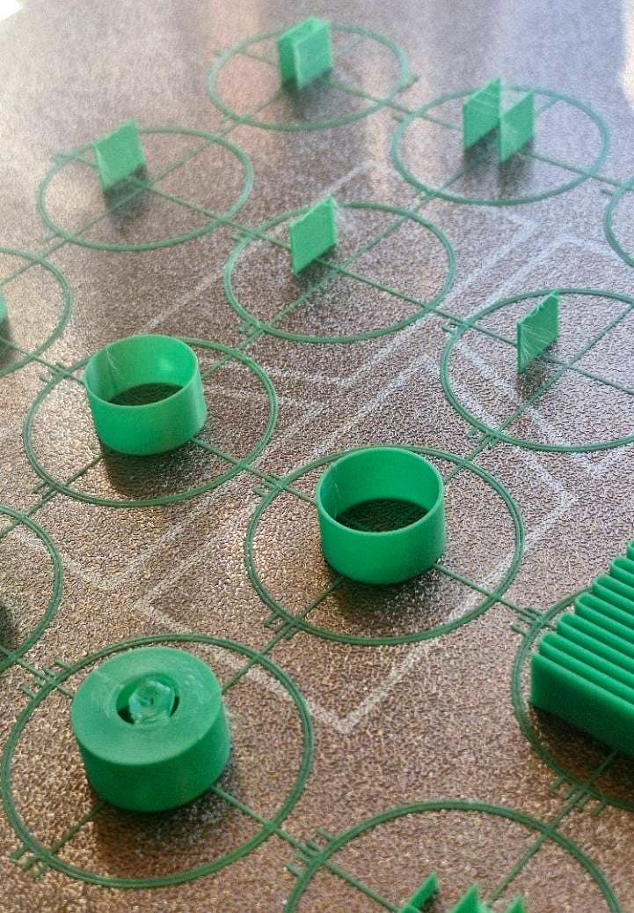<br><sub><b>LIMIT16</b> (179.9 x 179.9 x 9.6 mm): sixteen instruments on one plate — bridges of 4, 8, 12 and 16 mm, cantilevers, wall cups, a membrane disc, a 360 mm serpentine — joined on the first layer into one island. 16 mm is a qualified distance, not a measured failure threshold.</sub></td>
</tr>
<tr>
<td>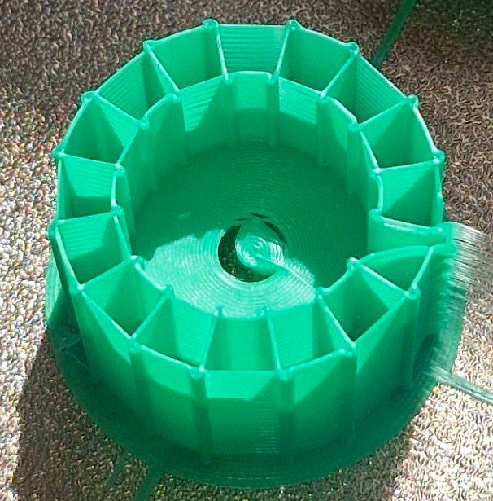<br><sub><b>Support is not survival.</b> The one MERA 4x4 membrane that mostly formed. The Gate reported a rim anchoring of 1.000 for all four membranes on the plate; three collapsed into loose coils. Geometric support and physical survival are different quantities.</sub></td>
<td>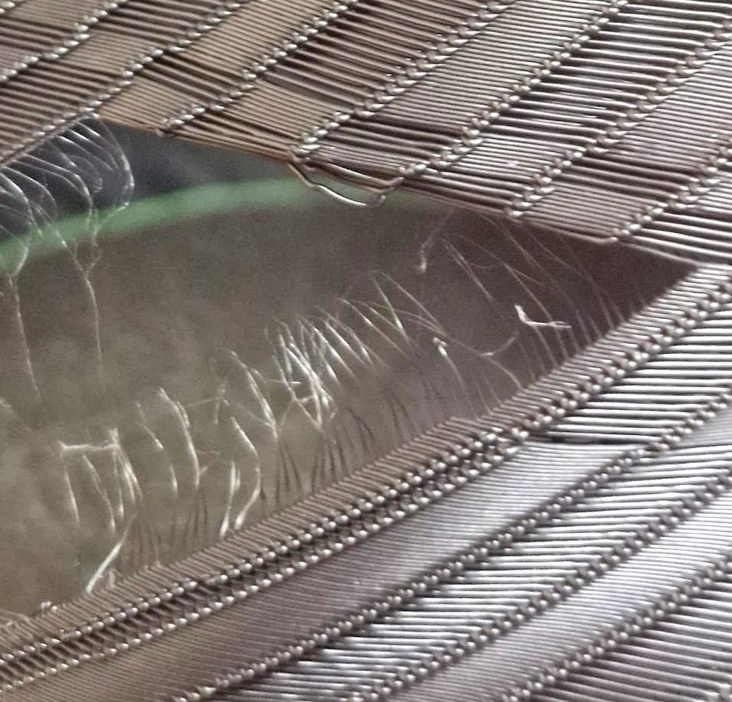<br><sub><b>Window in OBLAK.</b> The fine hairs across the void are travel moves, not deposition: 412 moves of 20 mm or more, 45.6 m in total. They are invisible to a Gate that only screens extruding segments.</sub></td>
<td>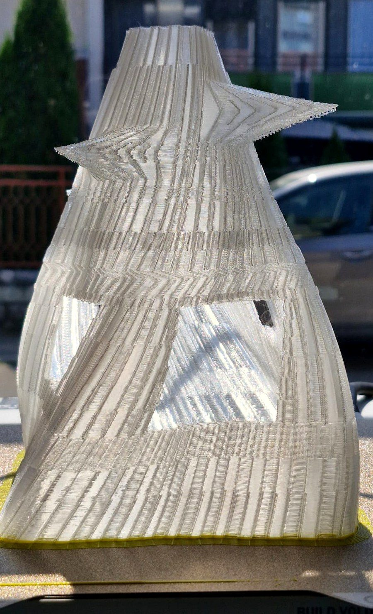<br><sub><b>GORA</b> (151.5 x 153.7 x 191.2 mm, 956 Z levels, 583 m of thread) on the Ender-3 V4, printed on an assumed bead width. Lintels held on every window; the woven iris crown closed as a clean triangular mesh.</sub></td>
</tr>
<tr>
<td>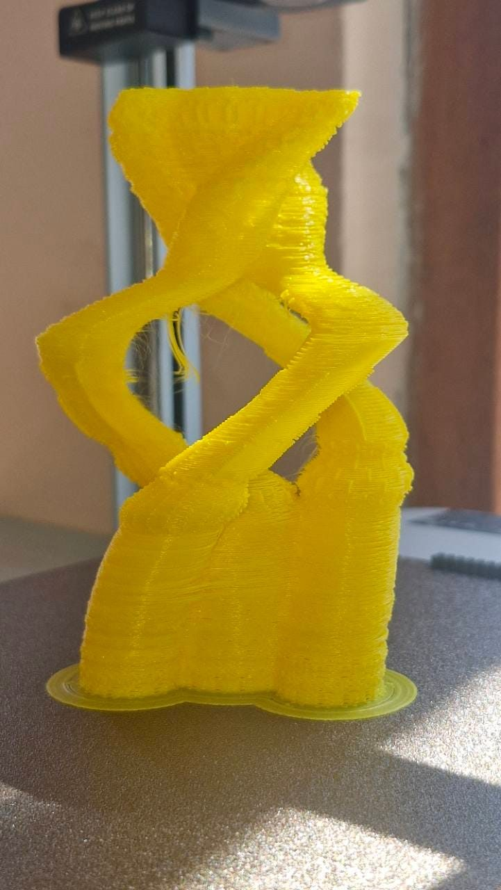<br><sub><b>V1 Vrtlog</b> (90 x 86.9 x 130.4 mm), a twisted vase on the Ender-3 V4: full height, no layer shift; heavy travel stringing through the eyes.</sub></td>
<td>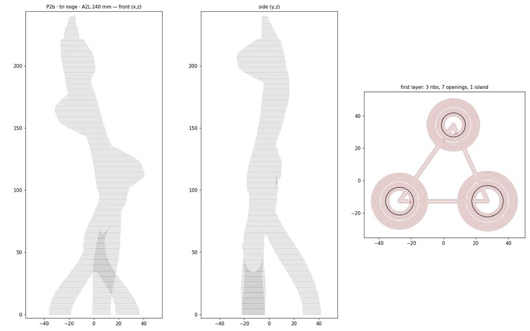<br><sub><b>P2b Penjač</b>, a 240 mm three-legged column: the Gate passed all 303,558 checked points with zero problems, and the body broke during the print. A static planar support analyser cannot see a dynamic failure.</sub></td>
<td>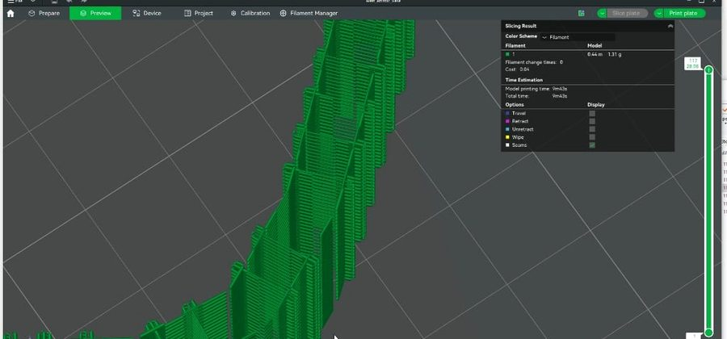<br><sub><b>The 4 September incident.</b> A language model, working only through the compiler's parameter contract, announced a balanced, printable design. The slicer preview showed stepped, disconnected shells. The screenshot withdrew the claim; the model never touched machine code.</sub></td>
</tr>
</table>

---

## How it works

```
 form (parameters, preset, or a level-2 geometry file)
   │
   ▼
 Level 1 · global topology     contour tree over height: births, splits, merges, deaths, courtyards, crowns
 Level 2 · meso lattice        node field on the surface: density, phase (stacked / sinusoidal / helical), tabs,
                               registration across merges — core/weft_<model>_geometry.mjs (byte-identical
                               JavaScript twins of the Python generators)
 Level 3 · micro thread        one continuous path per body and layer; grammars staple / diagonal / perpendicular /
                               sine / figure-eight; weld nodes, chords, feedrates — core/weft_core.js
   │
   ▼
 G-code with the machine's own harvested start/end blocks
   │
   ▼
 THE GATE  core/weft_gate.js (= check_gcode.py)   rasterise layer n-1 → distance transform → every extruding point
                                                   of layer n is SUPPORTED, a LEGAL BRIDGE (arc length ≤ L_max) or
                                                   REFUSED (FLOATING, LONG_BRIDGE, CANTILEVER, UNANCHORED_MEMBRANE,
                                                   BAD_MEMBRANE, DISCONNECTED_FIRST_LAYER)
   │ pass                                 │ fail → nothing printable is left behind
   ▼
 header rewritten from the file's own moves → .gcode.3mf (Bambu) or .gcode (Klipper) → manifest → specimens/
```

Three rules the record taught us, all enforced in code:

- **The Printable Footprint Rule.** Every extruding point of layer *n* must fall within the footprint of the
  material of layer *n-1*, expanded by half a bead plus a tolerance; the only exception is a bridge between two
  supported anchors no longer than the qualified limit. Written after the D5 crown; it is what the Gate measures.
- **Bead and layer height belong to the machine, not the design.** `machines.json` owns them and records whether
  a bead was *measured in plastic* or *assumed*. Building on an assumed bead requires saying so on the command line,
  and the manifest says so too.
- **Belief is not measurement.** A generator may believe a membrane is anchored; the Gate measures it on the final
  file, and the two must agree. Membrane processes carry a versioned identity and a physical status (`qualified`,
  `experimental`, `failed`); a failed process is always refused, an experimental one only ships on explicit opt-in.

## Run it

Everything runs on Node alone — no Python, no build step, no model.

```
git clone https://github.com/3esign/weft
cd weft
node weft.mjs machines                                   # the calibrated printers and what is assumed
node weft.mjs presets                                    # the studio presets
node weft.mjs build limit16   --machine a2l --out out/limit16
node weft.mjs build climber   --machine a2l --H 240 --legs 3 --out out/p2b --allow-experimental-membrane
node weft.mjs build sculpture --machine ender --variant gora --out out/gora --allow-experimental-bridge --i-know-the-bead-is-a-guess
node weft.mjs check FILE.gcode --machine a2l             # the Gate on any G-code
node weft.mjs serve                                      # the browser studio at http://127.0.0.1:8765
```

The browser studio (`index.html`, double-click it; Three.js is vendored) models plan-curve walls and domes,
imports open OBJ meshes, sweeps parameters in batch plates, and runs the same Gate before it offers a download.
`USAGE.md` is the operating manual; `MCP_START_HERE.md` is the contract for driving WEFT from a model.

To add a printer, slice anything in your own slicer and let the wizard read it:

```
node core/weft_machine_wizard.mjs my_export.gcode.3mf --id a1_lab03 --label "Bambu A1 lab 3" --out out/a1_lab03
```

It writes a `machines.json` candidate with the start/end blocks and every value's source. The bead stays
`ASSUMED` until you print the C1 coupon (`node core/weft_c1_calibration.mjs`) and measure it.

## Reproducing the paper

| claim in the paper | how to check it here |
|---|---|
| The Node chain reproduces the printed LIMIT16 A2L package byte for byte | `node tests/build_parity.test.mjs` (G-code sha256 c8aa2563…, all 17 members of the `.gcode.3mf`) |
| The JavaScript Gate equals the Python Gate | `node tests/gate_parity.test.mjs` (with `python3` + scipy; otherwise against the recorded JSON) |
| The JavaScript level-2 generators equal the Python originals | `node tests/<model>_geom_parity.test.mjs` for suma, limit16, plate, sculpture, climber, vase, paired, aero, c1 (needs python3 with numpy/scipy/scikit-image; 0 differing numbers) |
| The JS geometry of P2b, GORA, DAH and ODJEK produces the shipped G-code | `tests/climber_js_build_parity.test.mjs`, `tests/sculpture_js_build_parity.test.mjs`, `tests/paired_js_build_parity.test.mjs` |
| Every number in Table 3 of the paper | `specimens/*/manifest.json`, `*_gate.json`, `*_report.json`, `outcomes.md` |
| The Gate's mechanism as described in Section 5.2 | `check_gcode.py` (the header documents the method) and `core/weft_gate.js` |

`npm install` (Playwright, dev only) and `npm test` run the whole suite, including the browser parity tests and
the legacy studio suite (49/61 — the twelve known failures are listed in `docs/STATE_2026-09-16.md`).
Photographs and the largest printed-object G-code files are not in the repository for size; every photograph is
listed by name and hash in its specimen's `photos/manifest.json`, and the files are available from the authors.

## Repository map

```
index.html                 the browser studio (buildless; loads core/weft_core.js and core/weft_gate.js)
weft.mjs                   the command line: build · check · machines · presets · serve
core/weft_core.js          level-3 emitter (the engine the studio and the CLI share)
core/weft_gate.js          the Gate (port of check_gcode.py, held to it by tests)
core/weft_build.mjs        build chain: thread → G-code → gate → header → 3MF package → manifest
core/weft_*_geometry.mjs   level-2 generators in JavaScript (suma, limit16, plate, sculpture, climber, vase, paired, aero)
core/weft_geom*.js         the numeric kernel that makes them byte-identical to numpy/scipy/skimage
core/weft_machine_wizard.mjs   slicer export → machine profile candidate
*_geometry.py, check_gcode.py  the Python originals, kept as reference implementations
machines.json              the printers: bead, layer height, plate, start/end blocks, and whether the bead was measured
specimens/                 the evidence: one folder per built object
schemas/                   design parameters, membrane qualification receipts
tests/                     parity, gate, studio and wizard tests
docs/                      state of the repository and the application plan
```

## Where this is going

`docs/APP_PLAN_v1_2026-09-16.md` is the plan for WEFT Studio: a desktop application anyone can run, with a modeller
for WEFT-able forms, mesh import with a WEFT-ability report, a first-layer guard, printer profiles from slicer
exports, and the Gate in the loop of every export. Phase 1 (the whole chain in JavaScript) is done;
`docs/STATE_2026-09-16.md` records what was measured.

## Citing

```
Poturak, S., Mitrović, J., Končarević, B., Vračarić, M. and Stojiljković, T. (2026).
Printable Intelligence: The Leap into Micro-Structures and Tracing Human-AI Fabrication.
STRAND / ON ARCHITECTURE 2026, Belgrade. Software: https://github.com/3esign/weft
```

A machine-readable citation is in `CITATION.cff` (GitHub's "Cite this repository" button uses it).
