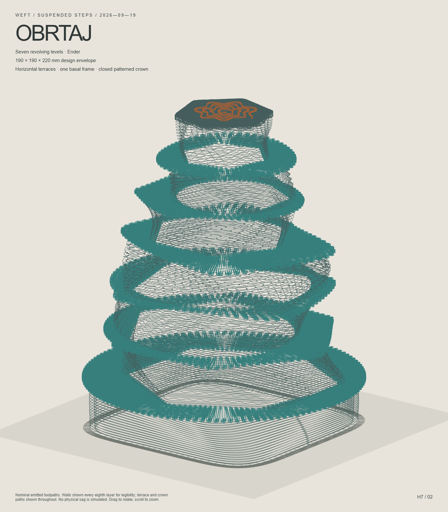

# OBRTAJ · Ender / seven levels

Two purposes: a distinct stepped sculpture and an aggressive horizontal-WEFT experiment. **Generated and digitally checked; NOT PRINTED.** [Current outcome](outcomes.md) · [Predictions and observations](PREDICTIONS.md) · [Rebuild protocol](PROTOCOL.md).

## Files

- **Print with the preserved WEFT order:** [OBRTAJ_ENDER_H7_FIRST_LAYER_FIXED.gcode](OBRTAJ_ENDER_H7_FIRST_LAYER_FIXED.gcode). This is the machine-profile G-code with its existing harvested start/end sequence.
- [Interactive offline review](preview.html): rotate, front/roof views and a height slider. Walls are sampled every eighth layer for visibility; the STL and printer file contain all layers. Colours identify regions in the preview, not filament changes.
- [STL reference](OBRTAJ_ENDER_H7_reference.stl): 225.2 MB, all emitted bead ribbons. Re-slicing this reference changes the WEFT deposition order; the supplied G-code is the ordered experiment.
- [Editable geometry](OBRTAJ_ENDER_H7_geometry.json) and compressed copy; [final audit](FINAL_AUDIT.json), [complete evidenced-ceiling report](OBRTAJ_ENDER_H7_gate_at_16.2mm_full.json), [delivery hashes](DELIVERY_MANIFEST.json).

## Dimensions and process

Nominal deposited envelope **189.92 × 189.92 × 220 mm**; allowed envelope 190 × 190 × 220 mm. Bed-edge clearance is at least 15.04 mm; clearance above the object is 15.00 mm. The STL mitered corners also remain inside the 15 mm margin. Model clearance excludes the printer's preparation and parking movements.

1100 Z levels at 0.2 mm. Nozzle profile 0.4 mm; nominal bead 0.42 mm, first-layer bead 0.48 mm; 220 °C / bed 60 °C. The Ender bead remains ASSUMED, explicitly acknowledged in this build.

Only the basal perimeter frame touches the bed. The 6 annular terraces hold a fixed footprint for twelve layers each, shift the return pattern by a quarter-cell between layers, and carry each subsequent wall. They project both inward and outward, without bed-founded interior tubes. There are 7 wall levels; the closed roof is the final horizontal surface.

| Wall | Plan | Z extent, mm | Rotation | Texture and repeating layer roles |
|---|---|---|---|---|
| 1 | Rounded square | 0–32 | 0 → 12° | staple; chord / web |
| 2 | Rounded hexagon | 34.4–65.4 | 0 → 30° | sine; chord / chord / web |
| 3 | Ellipse | 67.8–97.8 | 20 → -10° | diagonal; chord / web |
| 4 | Rounded square | 100.2–129.2 | -15 → 20° | eight; chord / web / web |
| 5 | Rounded hexagon | 131.6–158.6 | 30 → 0° | staple; chord / web |
| 6 | Ellipse | 161–187 | 0 → 60° | diagonal; chord / web |
| 7 | Rounded hexagon | 189.4–215 | 15 → 45° | sine; chord / web |

| Terrace | Nominal bottom–top, mm | Print layer numbers (one-based) | Return cells/layer | All findings at 16.2 mm |
|---|---|---|---|---|
| terrace-1 | 32–34.4 | 161–172 | 124 | 1478 |
| terrace-2 | 65.4–67.8 | 328–339 | 104 | 235 |
| terrace-3 | 97.8–100.2 | 490–501 | 80 | 545 |
| terrace-4 | 129.2–131.6 | 647–658 | 80 | 582 |
| terrace-5 | 158.6–161 | 794–805 | 72 | 61 |
| terrace-6 | 187–189.4 | 936–947 | 56 | 60 |

The roof alternates X/Y grids through pitches 10, 5, 2.5 and 1.2 mm, then two dense crossed layers at 0.378 mm pitch. A seven-layer raised 7-lobed growing wave finishes it. [Roof view](OBRTAJ_ENDER_H7_roof.png). The coverage audit sampled 66,484 interior points at 0.2 mm spacing and found 0 uncovered points at nominal bead width. This is a digital coverage check, not a watertightness or physical-print claim.

Object-only estimates from extruding moves: 33.352 m of 1.75 mm filament, approximately 101.08 g at assumed density 1.26 g/cm³. Kinematic time is **at least 16.577 h**, without acceleration, heating, waits or firmware macros; it is not the machine's completion-time prediction. Total deposited path length is 1008.1 m and must not be confused with filament feed length.

## Validation and limits

First-layer audit: **2531 actual model extrusion segments at Z0.20 mm**, with the first preview deposition at the same height. Startup/purge is marked as preparation/wipe without changing printer commands. [Correction and command identity](FIRST_LAYER_REPAIR.json). The old Ender file that was open in the slicer is superseded; load the distinctly named FIRST_LAYER_FIXED file above. Native slicer UI was not operated during verification.

Final G-code gate: PASS, 0 problems, 1,405,352 checked points. Declared ceiling 180 mm, cantilever limit 4.8 mm, ordinary support tolerance 0.6 mm. The existing Ender footer retains its relative 5 mm lift and END_PRINT call; firmware macro internals are not simulated.

The **complete** 16.2 mm check records 2966 findings, all inside explicitly declared narrow terrace/roof zones; zero outside. These are admitted experiments beyond prior evidence, not proven printable spans. Every finding is retained and reviewed; the final file's identity is checked in FINAL_AUDIT. Independent declared, evidenced and package passes use the existing WEFT gate in separate workers; files remain PENDING until all required checks pass.

Wall, terrace and art overlap findings: zero. The raw thread report also records 239 contacts in the final two dense roof layers; these are intentional adjacent fill overlaps and remain visible in the report. No gate exemptions were added to hide them. Geometric crossings do not establish weld quality. A returning free-tip loop can pass the bridge classification while remaining a mechanical cantilever challenge.

Honest verdict: machine-profile dimensions, emitted planar layers, hollow basal support, nominal roof coverage, overlap locations, final support gates and artifact identities were checked. Counterweight benefit, tension, thermal behaviour, sag, strength and physical completion remain unmeasured. No printer upload or print was initiated.
