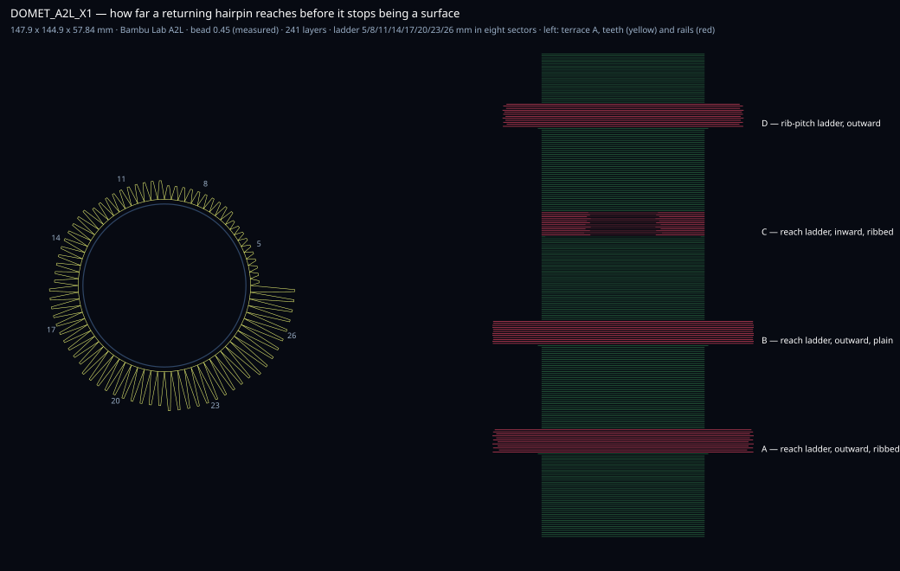

# DOMET · Bambu Lab A1 mini

An **instrument**, not a sculpture. It measures how far a returning hairpin can reach into open air before it
stops making a horizontal surface, and whether circumferential ribs under the teeth raise that limit.
**Generated and digitally checked; NOT PRINTED.** [Predictions and how to read it](PREDICTIONS.md) ·
[Rebuild protocol](PROTOCOL.md) · [Outcome](outcomes.md).

## Why it exists

On 2026-09-23 two objects built by another mind on 2026-09-19 were printed. `OBRTAJ_ENDER_H7` came out with its
six horizontal terraces **flat** — the first level floating surface in this project. `RAZMAK_A2L_H4` came out
flat on its straight runs and **tangled** where the return was longest, and the print was stopped for machine
safety. Measuring both geometry files gave the free reach of each terrace's first layer: the Ender terrace that
held has a median of 18.1 mm and a minimum of 6.6 mm; the A2L terrace that failed has a median of 28.6 mm and a
minimum of 20.1 mm. The limit is therefore bracketed between roughly 25 and 29 mm — but layer height and speed
moved at the same time, so nothing was isolated. This object isolates it.

## What it is

One cylinder of 48 mm radius. Four terraces on it. The walls between them are identical, so a
terrace can only differ from another terrace by the thing being tested.

| terrace | what it tests | z, mm | cells | distinct paths in 12 layers | reach per sector, mm | rib pitch per sector, mm |
|---|---|---|---|---|---|---|
| A | reach ladder, outward, ribbed | 10.08–12.96 | 80 | 12 | 5 / 8 / 11 / 14 / 17 / 20 / 23 / 26 | 5 / 5 / 5 / 5 / 5 / 5 / 5 / 5 |
| B | reach ladder, outward, plain | 23.04–25.92 | 80 | 2 | 5 / 8 / 11 / 14 / 17 / 20 / 23 / 26 | none / none / none / none / none / none / none / none |
| C | reach ladder, inward, ribbed | 36–38.88 | 63 | 12 | 5 / 8 / 11 / 14 / 17 / 20 / 23 / 26 | 5 / 5 / 5 / 5 / 5 / 5 / 5 / 5 |
| D | rib-pitch ladder, outward | 48.96–51.84 | 80 | 12 | 20 / 20 / 20 / 20 / 20 / 20 / 20 / 20 | 3 / 4 / 5 / 6 / 8 / 10 / 14 / none |

Sectors are 45° and **ascend**, so the break reads as the angle at which the comb stops being a comb.
A → B isolates the ribs. A → C isolates the direction (inward has no wall mass outboard of the tip).
D isolates how far apart ribs may be, and its eighth sector has none at all.

## The method

A terrace layer is either **R** — a triangle wave of returning teeth whose base sits on a continuous ring — or
**C** — circumferential rails that cross every tooth at very nearly 90°. R and C alternate. A rail gives the
next wave a landing every rib pitch, so only the **first** layer of a terrace is a full-length cantilever;
after that a tooth is a beam on supports. The ribs are Semir's own instruction of 2026-09-18, *"in the next
layer make rails for next layer"*.

Two defects measured in the 2026-09-19 terraces are fixed here. Those terraces contain only **two** distinct
paths — layer *k* equals layer *k+2* point for point, so each path is laid six times onto itself, the same
fault found at layers 164/165 of `ZIGURAT_TKANJE_A2L_X1`. Here each of the six R layers carries a different
phase and each of the six C layers a different rail offset, so no layer of a terrace coincides with another
(terrace B keeps the two-path scheme on purpose — it is the control). And those crossings had a median angle
of 16–54° with 44 % below 10° on the largest terrace; a rail crosses a tooth at ~90°.

## Dimensions and process

Nominal envelope **147.9 × 144.9 × 57.84 mm** on a Bambu Lab A2L plate, 241 layers at 0.24 mm.
Nozzle 0.4 mm; bead 0.45 mm, measured. Wall 10.08 mm between terraces, 12 layers per terrace,
tooth pitch 4 mm, tip gap 1.2 mm. Only the cylinder touches the bed; every terrace is in mid-air.

Emitted: **NaN m of thread**, undefined welds, undefined paths.
Header, recomputed from the file's own moves: 349 layers, NaN m of 1.75 mm filament,
**undefined g**, max Z undefined, **undefined** kinematic (no acceleration, heating or waits; not the machine's own prediction).
Thread length and filament feed are different quantities — the ratio here is about 30:1.

## Gates

Declared ceiling: bridge 60 mm (the chain's experimental maximum), cantilever 8 mm.
**Final G-code gate: PASS — 0 problems / 456323 points / 242 layers, first layer 1 island.**
The 60 mm ceiling is why the ladder stops at 26 mm and not higher: the gate measures a returning hairpin by its
**path length between anchors**, so a 26 mm reach is scored as a 52 mm bridge. That is itself a finding — a
hairpin's two legs are half a millimetre apart and behave as one folded cantilever, not as a bridge.

At the evidenced 16.2 mm ceiling: **598 findings, 0 outside the declared terraces** —
terrace A 141, terrace B 75, terrace C 138, terrace D 244. These are admitted experiments beyond prior evidence, not proven printable spans.

Same-layer contacts: **4745**, all on typed terrace paths, where the triangle wave meets its own base
ring at every cell. They are deliberate root welds, they are located in the report, and no gate exemption hides them.

Honest verdict: dimensions, emitted planar layers, support gates and file identity were checked. Sag, bond
quality, the value of the ribs and physical completion are exactly what this object is meant to measure and are
unmeasured until it is printed.
